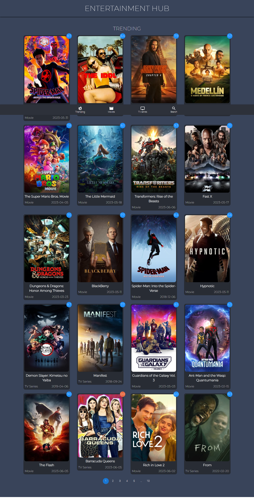

# React Movie Searching App


<br>


## About The Project

#

This is movie searching website that allows users to search for movies by title, genre or other criteria.
This site is build with `React, Materia UI ,Vanilla CSS` and uses [Themoviedb](https://www.themoviedb.org/) API for images and videos.

### Here are some of the features of Movie Searcher :

- Users can search for movies by title, genre or other criteria.
- View information about movies: Users can view information about movies, such as the cast, crew, release date, and user ratings.
- Simple and easy-to-use interface: `BlissHours` has a clean and modern design, and it is easy to navigate.
- Built using React: `BlissHours` is built using React  
  <br>

👉 [Live Demo](https://bliss-hours-movie-searching-site.netlify.app/)

## Build with:

» React  
 » Material UI  
 » Vanilla CSS  
 » Themoviedb API

<br/>

# Screenshot of the project 📸

<br/>
 <h2 align=center>Home Page 🏡</h2>



## Installation

```bash
  git clone https://github.com/John-santhosh/react-MoviesDB

  npm intall

  npm run dev
```

## contribution

Pull requests are welcome, For Major changes, please open an issue first to discuss what you want to like to change
